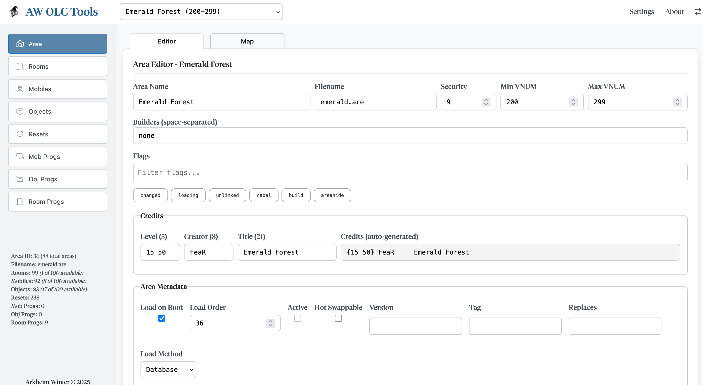
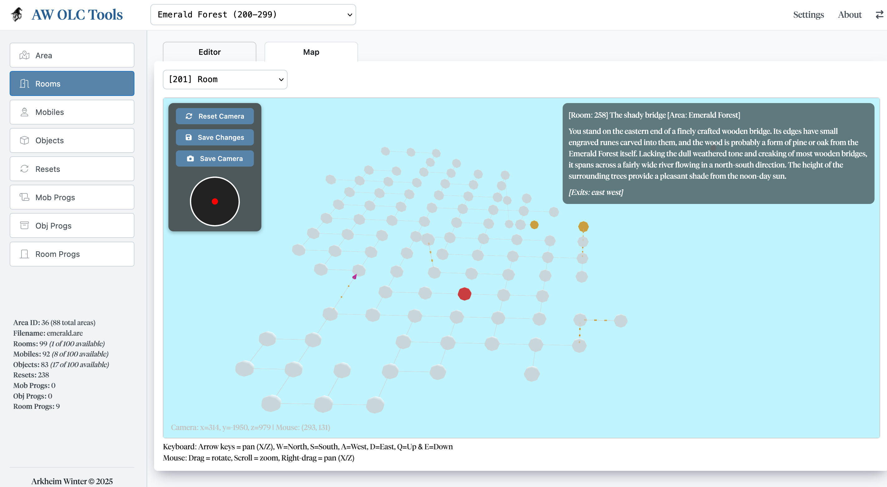
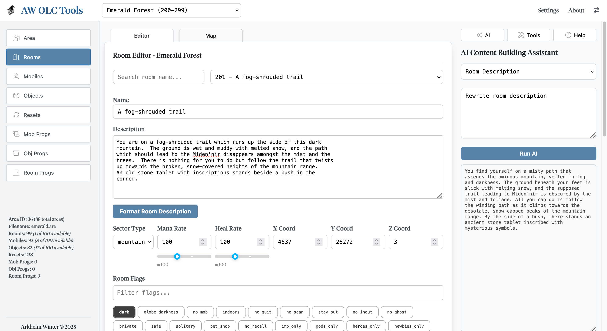
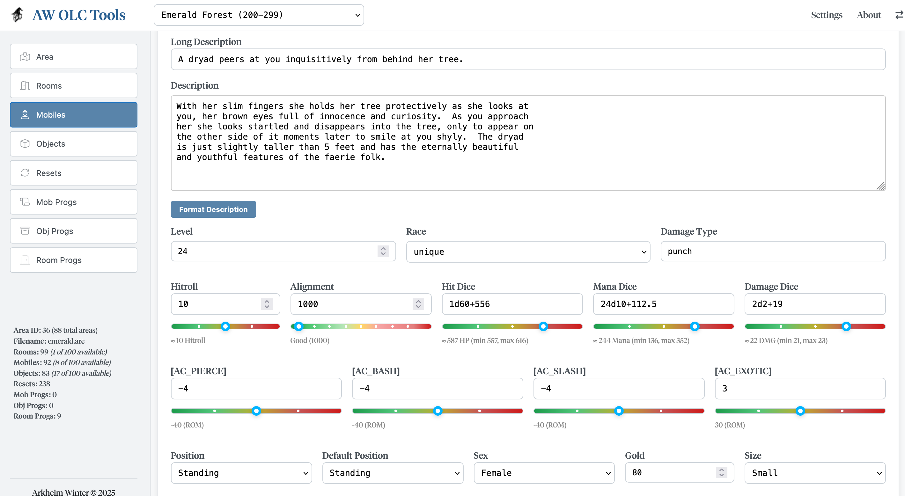
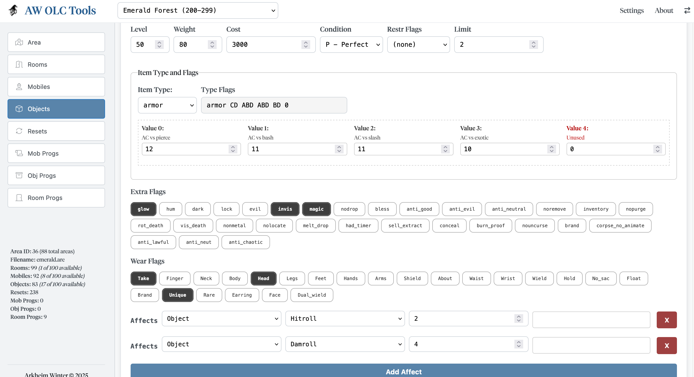

# AW OLC Tools – Web-Based MUD Area Editor

Features
	•	Visual map editor with 3D room layout (Three.js)
	•	Live editing of rooms, mobs, objects, and resets
	•	AI-assisted room and NPC description generation
	•	MySQL backend for persistent area storage

# Area Editor
Area edit with loading options.

 
 
# Map Editor
Area files are loaded from db and automaticlally set up in 3D space, with optional coords override for bad rooms.
You can walk around or click rooms, all areas are connected and linked by yellow nodes, clicking those or walking into those
will change map to that area.

 

# Room Editor
Build in AI assistant, using pre set headers that can be edited in settings, plan is to extend usage of room information that
can help define descriptions, like sector, room flags and exits.

 

# Mobile Editor
Optional AI assistant to help create or edit descriptions, also using headers. Mob stats predefined, based on level and with sliders for fine tuning.

# Object Editor

# Tech Stack
	•	JavaScript (Three.js, OrbitControls)
	•	PHP + MySQL backend
	•	HTML/CSS interface
	•	Optional integration with running MUD servers

# Note
This is a personal project and proof-of-concept. It’s not intended as a finished toolset but as a demonstration of what modern web tech can bring to MUD development.
